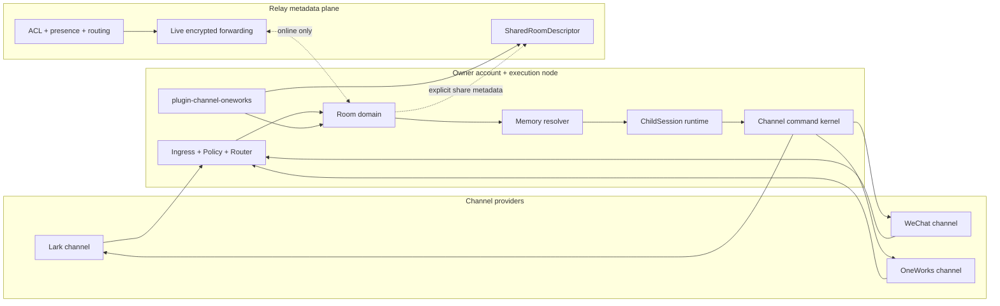

# RFC 0006: Channel Runtime 2.0

## Summary

Channel Runtime 2.0 把 OneWorks、飞书、微信、Telegram、Discord 等消息入口统一成实体驱动的多渠道工作系统，并把现有 Agent Room 激进重构为唯一的 Room 领域。

核心语义：

- **Room 是协作聚合，不是传输协议。** 一个 Room 可以接入多个 ChannelLink，并聚合人、实体、run、消息和投递结果。
- **Channel 是传输 provider。** `lark`、`wechat`、`oneworks` 等 provider 负责收发、原生身份、平台引用和导航能力。
- **创建 Room 的账号和执行节点拥有完整权威数据。** Room 消息、run、记忆和投递明细只保存在 owner 节点。
- **Relay 只保存显式分享关系、ACL、presence 和在线路由。** 它不保存 Room 消息正文、run 内容或离线消息队列。
- **每条需要执行的入站消息创建短生命周期 ChildSession。** 持续对话由 Room、ChannelLink、线程状态、pending intent 和带来源的记忆恢复，不复用一个无限增长的 adapter session。
- **实体可以绑定多个平台和同平台多个账号。** Agent 发消息时从实体可用且当前 actor 有权使用的 ChannelLink 中显式选择目标，不自动广播。
- **所有执行都知道自己在哪里。** ChildSession 获得不可变的 `ChannelExecutionContext`，明确 entity、Room、provider、channel key、账号、会话、actor 和默认回复目标。
- **命令只有一个内核。** CLI、Agent Tool 和产品 UI 都调用同一份 `ChannelCommandDefinition`/executor；权限按触发用户和统一 Tool Approval 计算。

分册：

- [Ingress Router](./0006-channel-runtime-2-ingress-router.md)
- [Channel Commands](./0006-channel-runtime-2-channel-commands.md)
- [OneWorks Channel 与聊天室插件](./0006-channel-runtime-2-oneworks-channel-plugin.md)
- [Identity And Routing](./0006-channel-runtime-2-identity-routing.md)
- [Memory Resolver](./0006-channel-runtime-2-memory.md)
- [Policy Engine](./0006-channel-runtime-2-policy.md)
- [Approval Policy](./0006-channel-runtime-2-approval.md)
- [Conversation Continuity](./0006-channel-runtime-2-continuity.md)

## Goals

- 用一个 Room 领域替代历史 Agent Room 与频道会话之间重复且冲突的数据模型。
- 支持消息来自任意 provider，也支持 Agent 把不同消息发送到不同 provider、账号和外部会话。
- 支持一个 Entity 使用多个 channel key；同一 provider 可以配置多个账号。
- 保留 `.oo.config.json` 的平台连接配置和 `.oo/channels/<link>/channel.json` 的实体绑定。
- 在消息、记忆、权限、审计和导航中保留 provider/account/conversation provenance。
- 支持跨平台身份绑定到 CanonicalUser，但不把身份绑定误认为 delegated credential。
- 支持软屏蔽、上下班、节流、backlog、白名单以及按 actor/mode 路由模型和 adapter。
- 支持显式且有限的 Room 分享；远端只在 owner 在线时读取或操作被分享的 Room。
- 复用现有 Agent Room 时间线、成员、run、审批/输入卡片和右侧 WebView 交互。
- 允许激进迁移历史 Agent Room 数据；当前没有线上用户，不维护长期兼容层。

## Non-Goals

- 不用 Relay 保存或搜索 Room 消息正文、run 内容和记忆正文。
- 不同步 execution node 上所有 Room；未显式分享的 Room 不得出现在 Relay。
- 不把不同 ChannelLink 自动互相转发，也不默认群发到实体的所有账号。
- 不凭昵称或头像自动合并跨平台身份。
- 不默认把私聊记忆带入群聊，或把一个 issuer 的账号/权限带到另一个 issuer。
- 不调用外部平台的真实封禁 API；软屏蔽只在 OneWorks ingress 层丢弃或固定回复。
- 不在 Channel Runtime 内单独实现一套审批产品；外部写操作接入统一 Tool Approval。
- 不要求所有 provider 一次性支持消息级深链、WebView、ephemeral 消息或离线补拉。

## Architecture



### Dependency Boundaries

```text
packages/types / packages/core
  shared Room, Channel, command, delivery and navigation contracts

packages/channels/*
  provider connections, native identifiers, send/receive and navigation resolution
  no Room orchestration, memory policy or product UI

apps/server
  Room, identity, policy, memory, command and share business orchestration
  routes/websocket/channels -> services -> db

packages/plugins/channel-oneworks
  OneWorks Chat Rooms product entry, sharing, simulations, scenarios,
  trace presentation and navigation preferences
  no provider credential lifecycle and no direct DB access

packages/plugins/relay + apps/relay-server
  device presence, explicit shared-room directory/ACL and online forwarding
  no Room content persistence

apps/client
  Room timeline, compact provenance/delivery UI and right-side WebView
```

## Domain Model

### Entity

可工作的 Agent 身份。一个 Entity 可以使用多个 `ChannelLink`，包括跨 provider 和同 provider 多账号。

### Channel Connection

`.oo.config.json` 中 `channels[channelKey]` 对应一个真实平台连接和发送身份。例如两个不同飞书 bot app 必须使用两个 channel key。`channelKey` 是 issuer namespace，参与身份、权限、记忆和审计隔离。

### ChannelLink

`.oo/channels/<link>/channel.json` 中的外部入口/投递目标，包含：

- `channelKey`
- 外部 address，例如 direct/group/thread
- 一个 Entity
- ingress、availability、moderation、routing 和 display metadata

一个 ChannelLink 只能绑定一个 Entity。一个 Entity 可以绑定任意多个 ChannelLink。当前 loader 继续 fail-fast 拒绝同一个 channel key 跨 Entity 复用，避免同一 bot credential/issuer 被多个实体混用；未来若支持共享 service account，必须先引入显式 ownership/impersonation contract，不能静默放宽。

### Room

本地协作聚合和权威边界：

- owner account、owner execution node
- leader Entity
- members 和 runs
- append-only RoomEvent
- timeline/member/run 等本地 projection
- 绑定的 ChannelLink 集合
- share 配置和 grant

Room 可以没有外部 ChannelLink，也可以聚合多个 provider。Agent Room 是这个领域的产品名称，不再是一套平行的数据模型。

### RoomChannelLink

Room 与既有 ChannelLink 的关联。它声明消息可以从哪里进入 Room、Agent 可以向哪里发送，以及该 link 在 Room 中的展示名和默认行为。它不复制 provider credential。

同一个 `(channelType, channelKey, channelId)` provider conversation 只能归属一个 Room；数据库唯一约束和 attach command 都 fail-fast，不能依赖查询顺序挑选 Room。

### RoomMessage

Room 时间线中的消息或事件。消息保留两个彼此独立的维度：

- `source`：消息实际来自哪个 provider/channel key/link/account/conversation/message/thread。
- `deliveries[]`：Agent 将消息投递到了哪些目标、每个目标的状态、平台 message reference 和错误。

一条消息可以来自飞书但只在 Room 内回复，也可以由 Agent 从 Room 发到微信。没有 delivery 的 Room 内消息仍然有效。

需要外部副作用的 Room message 先以 `pending` 状态和幂等键原子认领，再调用 session/provider。成功后写成 `delivered`；进程崩溃或结果不确定时保留待确认状态，同一幂等键不得再次触发外部发送。

### ChannelAccount And CanonicalUser

`ChannelAccount` 表示某人在特定 provider + channel key issuer 下的外部账号。多个 ChannelAccount 可以显式绑定到一个 `CanonicalUser`，用于跨平台识别、用户记忆和审计。

身份绑定只回答“是谁”。个人 OAuth/token/credential 另行回答“是否能代表他执行”。两者不得互相推导。

### RoomShare

owner 节点本地保存的分享定义和授权。权限至少包括：

- `view`
- `send`
- `target_member`
- `open_run`
- `approve`
- `manage_share`

默认远端分享只授予 `view` 和 `send`。run/session ID、workspace path 和内部错误默认不出 owner 节点；需要 `open_run` 时也返回 opaque remote reference，不暴露本地路径。

第一次分享 ownerless Room 时，产品插件必须把它绑定到当前在线且由用户选定的 Relay account/node；只有一个候选时可以自动选择，零个或多个未选候选都 fail-closed。后续不能把 Room 静默迁移给另一个 owner account。

### SharedRoomDescriptor

Relay 只持久化：

- share ID、owner user/device/node
- Room 的公开 label/icon/summary
- grantee/role/ACL
- owner presence 与 route metadata
- capability/version 信息

它不包含消息、run、memory、prompt、workspace path、外部平台原始 ID 或发送凭证。

## Ownership And Availability

1. Room 的完整状态只存在 owner account 的 execution node。
2. 只有显式分享的 Room 才向 Relay 发布 `SharedRoomDescriptor`。
3. 远端访问时 Relay 先校验 share ACL 和 owner presence，再建立 live route。
4. owner account 或 owner node 离线时，远端只能看到 Room 存在但 unavailable。
5. Relay 不为 Room 内容建立离线队列，也不在 owner 上线后回放远端消息。
6. 外部 provider 自己保存的历史可由 owner node 上线后按 provider capability 补拉；这是 provider 行为，不是 Relay 内容存储。
7. owner 节点最终重新校验 actor、share scope 和操作权限；Relay 的 ACL 不是唯一授权点。

## Inbound Lifecycle

```text
receive provider event
  -> normalize provider/account/conversation/message/mentions
  -> resolve channel key and ChannelLink
  -> resolve Entity and optional Room binding
  -> resolve ChannelAccount and CanonicalUser
  -> hard access check
  -> PolicyEngine: mute/off-hours/throttle/backlog
  -> IngressRouter: ignore/observe/create_child/defer
  -> persist RoomEvent/source provenance when visible to the Room
  -> stop when no execution is needed
  -> build ChannelExecutionContext
  -> MemoryResolver builds scoped snapshot
  -> route model and adapter
  -> create ChildSession
  -> execute commands and record deliveries
  -> terminal memory/writeback classification
  -> update local Room projections
```

PolicyEngine 和 IngressRouter 都在 ChildSession 前执行。被软屏蔽、下班普通消息、重复提醒和只观察的群聊不会创建 ChildSession。

## ChannelExecutionContext

每个 ChildSession 在开始时获得不可变 context：

```ts
interface ChannelExecutionContext {
  entity: { id: string; label: string }
  room?: { id: string; title: string; ownerNodeId: string }
  source: {
    channelType: string
    channelKey: string
    channelLinkId?: string
    accountLabel?: string
    tenantLabel?: string
    conversation: {
      id: string
      kind: string
      label?: string
      threadId?: string
    }
    message: { id?: string; replyToId?: string; rootId?: string }
  }
  actor?: {
    externalAccountId?: string
    canonicalUserId?: string
    displayName?: string
  }
  defaultReplyTarget?: ChannelDeliveryTarget
  availableDeliveryTargets: ChannelDeliveryTarget[]
}
```

系统提示必须把它投影为简洁的人类可读“当前工作位置”，例如：

```text
当前实体：产品助手
当前房间：示例脑暴
来源：飞书 / 示例组织 / 产品机器人 / 示例脑暴 / 线程 123
触发用户：示例用户（canonical user 已绑定）
默认回复：原飞书线程
```

## Conversation Continuity

每条被路由执行的入站消息创建一个新 ChildSession。连续对话不靠复用 adapter session，而靠程序化 thread key 和受控上下文恢复：

1. 优先使用 provider 原生 thread/root/reply reference。
2. 没有原生 thread 时使用 `channelKey + ChannelLink + conversation + actor + pending intent` 计算 continuity key。
3. IngressRouter 只决定是否执行和使用哪个模型/adapter，不决定把消息“塞给哪个仍在运行的 session”。
4. 最近 turns 有时间、数量和参与者预算；不会把整个群聊历史带进每轮。
5. pending intent 明确目标用户和所需动作；相关用户下一条消息可继续，其他用户不会误续。
6. Agent 一次任务需要发送多条消息时，在同一个 ChildSession 内多次调用 command kernel，不为每次 outbound send 创建新 session。

## Memory Loading And Writeback

Memory Resolver 按以下层次加载，并在预算前执行权限和来源过滤：

1. Entity 长期经验
2. CanonicalUser 跨平台偏好
3. Room 共享决策/项目记忆
4. 当前 ChannelLink/外部会话记忆
5. 当前 thread/recent turns
6. 当前 message

每条记忆必须携带：scope、visibility、sensitivity、entity、room、canonical user、channel type、channel key、ChannelLink、conversation kind/id、source message/run 和 expiry。

写回分类：

- 可跨场景复用的稳定经验 -> Entity
- 用户偏好 -> CanonicalUser
- 项目/协作决策 -> Room
- 平台或群内临时约定 -> ChannelLink/conversation
- 私聊内容 -> direct/private scope，默认禁止进入 group snapshot

同一 provider 的不同 channel key 视为不同 issuer；没有显式 identity/memory policy 不得互相读取。

## Outbound Commands

Agent 通过统一 command kernel 执行外发：

```text
ChannelCommandDefinition
  schema + actor context + permission + effect + audit + structured result
     |-- CLI: oneworks channel send ...
     |-- Tool: channel.send
     `-- UI/debug thin client
```

`channel.send` 至少接受一个显式 `ChannelDeliveryTarget` 和内容。默认目标来自 `ChannelExecutionContext.defaultReplyTarget`；跨渠道目标必须显式指定。多个目标是多次或数组式显式调用，不自动广播。

外部发送声明统一 effect metadata：

```json
{
  "effect": "external-write",
  "operation": "channel.send",
  "actor": "canonical-user-or-service-principal",
  "entity": "entity-id",
  "destinations": ["opaque-delivery-target"]
}
```

统一 Tool Approval 后续决定 auto-allow / ask / deny；Channel Runtime 不单独实现审批 UI。

## Message Navigation

provider 可选实现：

```ts
declare function resolveMessageNavigation(reference: unknown): {
  messageWebUrl?: string
  conversationWebUrl?: string
  nativeAppUrl?: string
  appHomeUrl?: string
  embeddable?: boolean
}
```

provider 只提供真实可用的 URL/capability。`@oneworks/plugin-channel-oneworks` 保存用户的导航顺序偏好，支持 default 和 provider/account override，例如 `rightPanel`、`externalWeb`、`nativeApp`、`appHome`、`ask`。

客户端点击消息上的平台图标/投递 chip 后：

1. 按插件偏好选择入口。
2. `rightPanel` 复用 `ChatWorkspaceDrawer`。
3. iframe 被 CSP/X-Frame-Options 拒绝时继续下一个 fallback。
4. 无消息级 URL 时降级到会话；再无会话入口时降级到应用首页或原生 App，例如微信。

## Product UI

Room 时间线复用现有 Agent Room 交互：成员、leader、run、审批/输入卡、直接 @member、room/session 视角切换。

消息来源/投递使用紧凑图标 chip：

- 单目标：`[Lark icon] 示例脑暴 ✓`
- 多目标：逐个显示紧凑的平台图标 chip；不把其余目标折叠成不可操作的 `+N`
- 账号/bot、组织、状态和错误放 tooltip/popover
- 成功状态弱化，失败明确显示

人类 composer 仍然只是在 Room 中发消息。provider/账号目标由 Agent 的 `channel.send` 命令选择，不在 composer 上制造一个“用户代 Agent 选择渠道”的主流程。

## Config

平台连接继续放在 `.oo.config.json`：

```json
{
  "channels": {
    "lark-product": { "type": "lark", "appId": "...", "appSecret": "..." },
    "lark-demo": { "type": "lark", "appId": "...", "appSecret": "..." },
    "oneworks-local": { "type": "oneworks", "webhookSecret": "..." }
  }
}
```

实体和 ChannelLink 继续目录化：

```text
.oo/entities/product/README.md
.oo/channels/product-lark/channel.json
.oo/channels/product-wechat/channel.json
```

Room、RoomChannelLink 和 RoomShare 是运行时本地数据，不内联进 `.oo.config.json`。OneWorks 聊天室插件的导航偏好使用插件自身 options/config，不污染 provider credential 配置。

## Persistence

owner 节点 SQLite 的目标表：

- `rooms`
- `room_members`
- `room_runs`
- `room_events`
- `room_channel_links`
- `room_shares`
- `room_share_grants`
- `room_messages` projection
- `room_message_deliveries` projection
- 现有 channel identity/policy/router/child-run/command/memory 表

当前实现采用混合持久化：`room_events` 是 append-only 的审计与命令幂等日志，Room 元数据、成员、run、消息和投递表则直接维护当前权威状态。事件日志当前不包含重建这些表所需的全部状态，因此不能把它描述为完整 event source，也不能承诺仅靠事件从零重建 projection。若后续要切换到完整 event sourcing，需要单独补齐事件模型、版本化 replay 和迁移验证。历史 `agent_rooms*` 数据采用 additive schema extension 和一次性 contract cutover，不提供长期 dual-read/dual-write。

Relay 的目标存储只有：

- shared room descriptor
- share ACL
- owner node presence/capabilities
- route/session metadata、大小、时间和错误码

Relay content boundary 必须拒绝 RoomEvent、message body、run payload、memory、prompt、platform raw event 和 credential。

## Security Invariants

- 所有跨平台 ID 都在 provider + channel key issuer 内解释。
- 结构化 mention 必须区分当前 bot、其他 bot、没有结构化 mention。
- remote share 操作在 Relay 和 owner 节点双重授权。
- synthetic simulation actor 不能提升为桌面用户、企业管理员或真实平台用户。
- CLI/Tool 不接受自报 sender/admin/session；服务端用短期 token 重建 actor/context。
- Room 分享不暴露本地路径、真实 credential、原始外部 ID 或未授权 run。
- Relay 不以日志、审计、重试或诊断名义保存消息正文。
- 私聊/用户记忆进入群聊前必须有显式策略。

## Migration

由于历史 Agent Room 没有线上用户，本次采用 additive schema extension 和一次性 contract cutover：

1. 在现有 `agent_rooms*` schema 上追加 owner/archive/favorite 等列，并创建 RoomEvent、RoomChannelLink、RoomShare 和 delivery 表。
2. 既有 Room/member/run/message 行继续作为当前状态读取；缺少 owner 字段的 Room 解释为本地 owner，不改写原始消息来源。
3. 当前迁移不为历史行合成 RoomEvent，也不声称事件日志可以重建既有 projection；只有新命令从启用本 contract 后开始追加审计/幂等事件。
4. 无法证明来源的历史内容保持无外部 provider provenance，不伪造 Lark、WeChat 或其他平台身份。
5. API/类型直接切换新 contract；不保留 dual write 和长期兼容分支。若未来确需历史事件回填，应单独提供可重复执行、带数量校验和回滚证据的 migration。

## Delivery Slices

1. **Contract and local Room authority**：共享类型、schema、repo/service、一次性迁移、source/delivery provenance。
2. **Execution context and memory**：ChildSession context、thread continuity、scoped MemorySnapshot/writeback。
3. **Command kernel**：`channel.send` CLI/Tool 共用 executor、effect/audit、delivery result。
4. **OneWorks provider and product plugin**：provider 导航能力、Room/分享/场景/trace 产品入口、配置化 fallback。
5. **Live shared Room**：Relay descriptor/ACL/presence/live gateway，owner offline fail-closed。
6. **Room UI**：紧凑平台图标、delivery 状态、右侧 WebView、remote unavailable/redacted states。
7. **Validation**：provider contract、privacy/issuer、Room migration、live-only Relay、真实 UI 与至少 Lark/OneWorks E2E。

## Acceptance Criteria

- 一个 Entity 可以绑定两个不同 Lark channel key 和一个 WeChat channel key，且 context/记忆/权限不串 issuer。
- 一条 Lark 入站消息进入 Room 后保留来源，Agent 可显式回复原线程或另发到 WeChat；不会自动广播。
- Agent 在一个 ChildSession 中可发送多条频道消息，不额外创建 ChildSession。
- Room 的私聊记忆不会出现在群聊 snapshot。
- 未分享 Room 不会出现在 Relay；分享后远端只看到 descriptor。
- owner 离线时远端拿不到 transcript，也无法把消息排队到 Relay。
- owner 在线时，远端 `send` 经 Relay live route 到 owner，owner 重新授权后写入本地 RoomEvent。
- 消息 chip 展示平台图标；支持的 provider 可在右侧 WebView 打开，失败时按插件偏好降级。
- `@oneworks/channel-oneworks` 在没有产品插件时仍能收发；`@oneworks/plugin-channel-oneworks` 不管理飞书/微信连接生命周期。
- 仓库中不存在 `@oneworks/plugin-channel-management` 兼容别名或通用管理职责。
