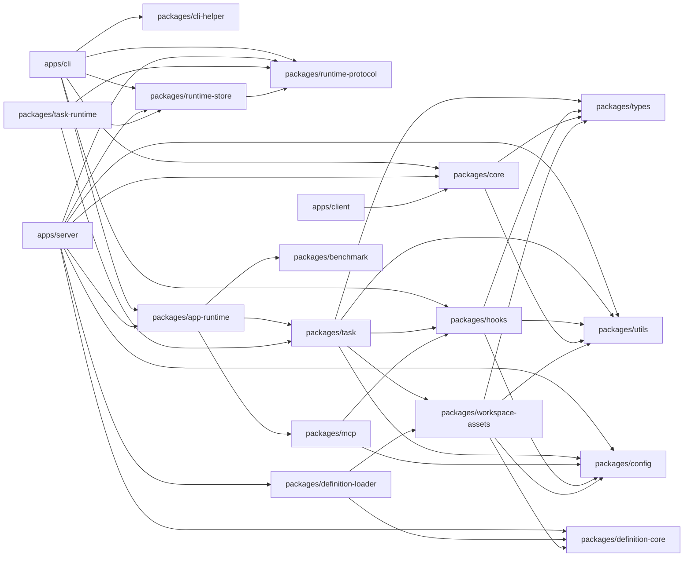

# 架构依赖

返回入口：[ARCHITECTURE.md](../ARCHITECTURE.md)

## 主干关系

## 依赖方向

- 应用层依赖 runtime / core，不反向。
- `task` 是 adapter 的运行时入口；adapter 由运行时解析，不让 app 直接编排。
- `ow agent`、server projection、task runtime 共享 `runtime-protocol` / `runtime-store`，task domain 不通过 MCP 暴露。
- `hooks`、`mcp`、`benchmark` 共享 `config` / `utils` / `types`，避免各自复制协议。
- `definition-core` 是 definition 领域共享语义层；Server 可直接消费。
- `definition-loader` 负责 definition 文档加载，`workspace-assets` 负责 workspace asset 投影与 prompt 组装。

## 扩展实现

- `channels/*`：由 Server / Client 消费 channel contract。
- `adapters/*`：由 `task` 在运行时按包名解析。
- `plugins/*`：由 `hooks` 在运行时装载。
