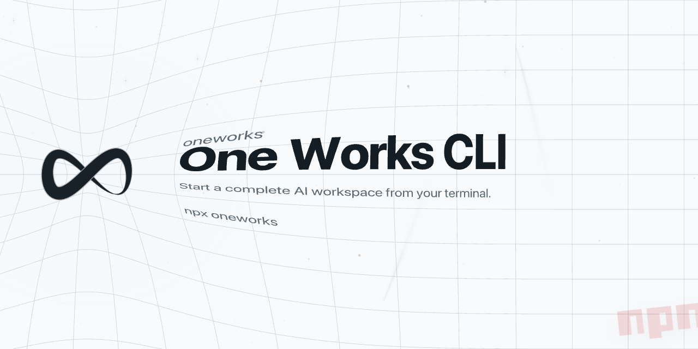

<picture>
  <source media="(prefers-color-scheme: dark)" srcset="./assets/npm-readme-header-dark.png">
  <source media="(prefers-color-scheme: light)" srcset="./assets/npm-readme-header-light.png">
  
</picture>

# One Works

Start the One Works workspace from your terminal:

```bash
npx oneworks
```

The bootstrap package locates or installs the matching One Works runtime and
then launches the requested desktop, web, or command workflow.
