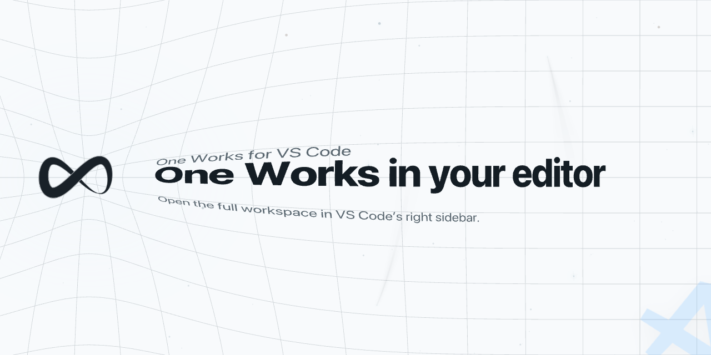

# One Works VS Code 扩展

[en-US](./README.md) | zh-Hans

<picture>
  <source media="(prefers-color-scheme: dark)" srcset="./assets/vscode-marketplace-dark.png">
  <source media="(prefers-color-scheme: light)" srcset="./assets/vscode-marketplace-light.png">
  
</picture>

这个包是 One Works Web UI 的轻量 VS Code 外壳。

## 本地使用

在仓库根目录执行：

```bash
pnpm -C apps/vscode-extension build
```

在 VS Code 中运行扩展，并从右侧 Secondary Side Bar 打开 One Works，或者执行 `One Works: Open Workspace`。

扩展会通过 `oneworks web` 为选中的 workspace folder 启动一个本机 One Works Web runtime，关闭本地 Web auth，并把集成 client 打开在 VS Code 右侧边栏 webview 里。多个 workspace folder 可以保留各自的 server，右侧边栏显示当前选中的 workspace。数据库、日志和运行数据使用 workspace project home，不写入 VS Code extension global storage。

扩展不会内置或自动安装 One Works runtime 包。它会依次查找选中 workspace 的 `node_modules/.bin` 和系统 `PATH` 中的 `oneworks` / `ow` / `owo`，再执行 `web` 子命令。

在需要控制的项目中安装 bootstrap launcher：

```bash
pnpm add -D oneworks
```

## 配置

- `oneworks.bootstrapCommand`：可选的 `oneworks` 可执行文件、命令名或 wrapper command。

## 边界

扩展不重复实现 client 或 server 业务逻辑，只负责 workspace 选择、server 进程生命周期和右侧边栏 webview 外壳。

## 发布

打包本地 VSIX：

```bash
pnpm -C apps/vscode-extension package
```

只有 stable source version 可以发布。预发布 source version 只由 CI 打包验证，不创建 package tag、GitHub Release，也不发布到 Marketplace 或 Open VSX。

从已有 stable VSIX 发布到 VS Code Marketplace：

```bash
VSCODE_EXTENSION_PUBLISHER=your-publisher-id VSCE_PAT=your-token \
pnpm -C apps/vscode-extension publish:vsix -- --packagePath ./oneworks-vscode-extension-v1.0.0.vsix
```

把同一个 VSIX 发布到 Open VSX Registry，供 VS Code 兼容 IDE 使用：

```bash
OVSX_PAT=your-token \
pnpm dlx ovsx@1.0.1 publish --skip-duplicate ./oneworks-vscode-extension-v1.0.0.vsix -p "$OVSX_PAT"
```

Open VSX 需要提前创建和 extension publisher 一致的 namespace，例如 `oneworks-ai`。

CI 会在 VS Code extension 变更时构建并上传临时 VSIX artifact。stable 发布只能从精确的 annotated `pkg/oneworks-vscode-extension/v<stable>` tag 人工触发，并要求 publisher variable 与两家商店凭据齐全。workflow 会先把唯一 authoritative VSIX 持久化到 GitHub Release，再把完全相同的字节发布到 VS Code Marketplace 与 Open VSX。
