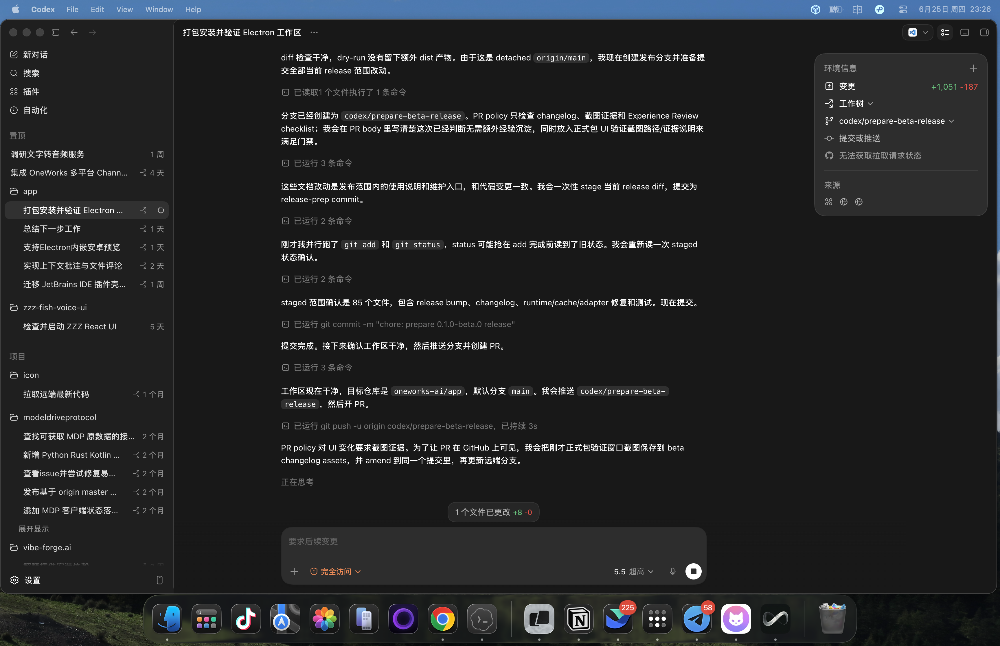

# One Works 0.1.0-beta.0

- Promote the One Works workspace package line from `0.1.0-alpha.0` to `0.1.0-beta.0`.
- Make packaged desktop builds seed the bundled CLI, server, client, plugins, and adapters into the versioned runtime cache so clean installs can run from bundled packages before registry packages are published.
- Let Codex and Claude Code adapters reuse compatible system or app-bundled CLIs before falling back to managed npm installs, while rejecting CLIs outside the supported version range.
- Surface adapter CLI preparation in the session UI, including automatic install progress when no compatible local CLI is available.
- Fix runtime operation projection so adapter preparation completion does not mark a session completed before the assistant response is recorded.
- Refresh active chat history when session updates indicate unseen assistant messages, preventing completed sessions from showing only the user prompt.

