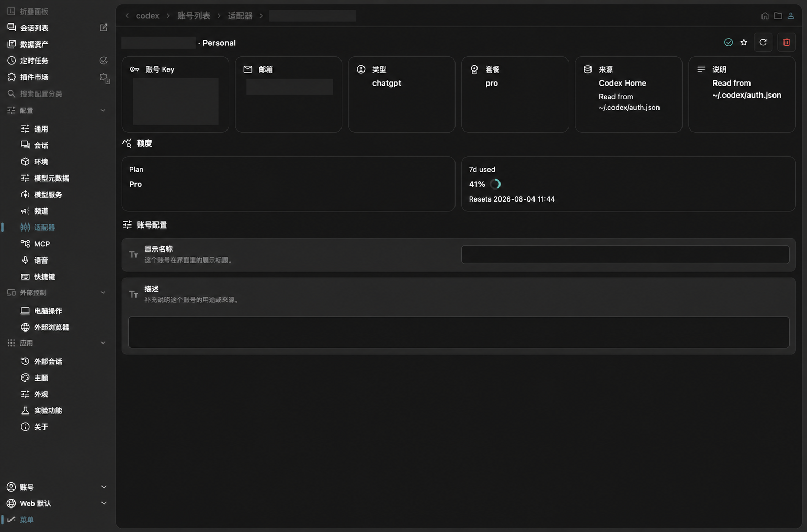
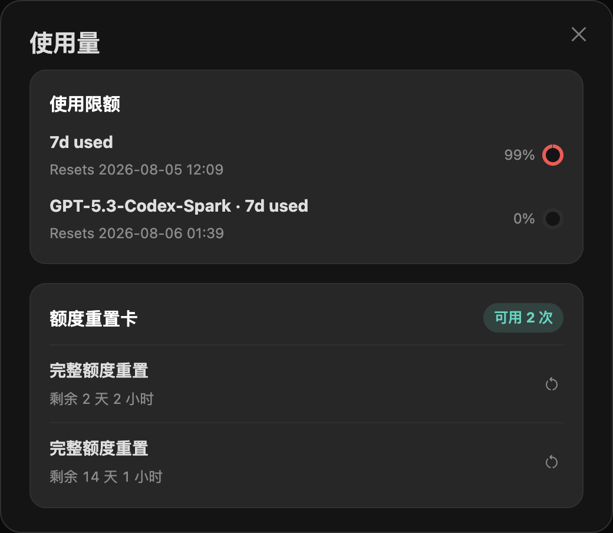

# @oneworks/client 0.1.0-beta.10

- Add a Launcher entry point for importing Codex and Claude Code history, resolve imported sessions to canonical projects, and open the resulting workspace directly from the project list.
- Add the Linear application icon theme. You can select and persist it in Web settings, with the Launcher and NavRail staying in sync; desktop uses the same preference and packaged icon assets.
- Polish Launcher settings with a full-bleed, content-sized tab strip and consistent 10px spacing, fix empty shortcut input rendering, and support `Command+,` on macOS or `Ctrl+,` on Windows and Linux to open settings directly.
- Refine Launcher menu surfaces with opaque theme-owned root and language submenus, keep icon-label spacing consistent at 6px, and show the platform settings shortcut alongside the settings command.
- Keep sender status-bar menus anchored and clickable when the account popup opens, including correct stacking above the composer input.
- Show runtime adapter account details even when the workspace has no adapter configuration schema, instead of falling back to an empty JSON editor.
- Remove the duplicate plugin configuration entry from the settings sidebar now that plugin management lives in the plugin marketplace, and safely redirect obsolete plugin settings links to General.
- Keep the new-session environment menu coherent when only the built-in default is available, and preserve a visible, keyboard-accessible control for restoring a collapsed status bar.
- Normalize new-session composer edge spacing to the shared 10px inset across compact and medium desktop windows while keeping the wide 800px layout centered.
- Show Codex quota usage and reset credits in both the composer and account details, keep all available reset cards visible after refresh, and require confirmation before consuming a card.
- Refine Codex quota interactions with compact reset-card rows, consistent icon actions, stable quota indicators, and a focused usage modal for the active account.
- Add unified token usage analytics across Launcher, workspace settings, model-service details, and account details, including local adapters, plugin/Relay sources, multiple accounts, model attribution, and adaptive filters.
- Load the active provider catalog from the server so newly published providers appear in model-service settings without requiring a full client release, and expose catalog updates as their own module group.
- Preserve the original imported-session timestamp separately from list activity recency.
- Show a provenance divider at the top of migrated Codex history.

