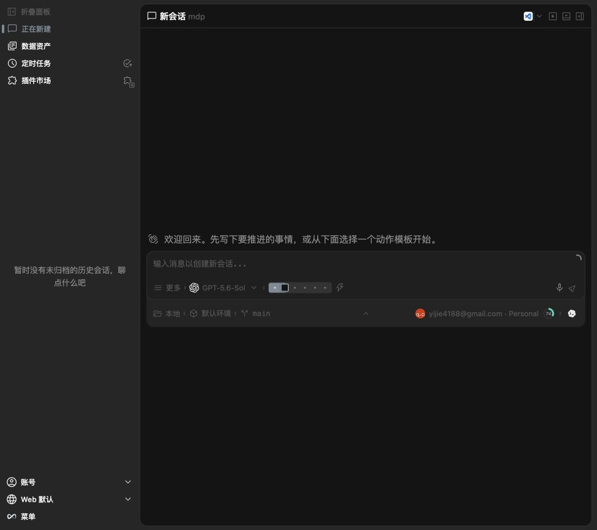

# @oneworks/client 0.1.0-beta.10

- Add the Linear application icon theme. You can select and persist it in Web settings, with the Launcher and NavRail staying in sync; desktop uses the same preference and packaged icon assets.
- Polish Launcher settings with a full-bleed, content-sized tab strip and consistent 10px spacing, fix empty shortcut input rendering, and support `Command+,` on macOS or `Ctrl+,` on Windows and Linux to open settings directly.
- Refine Launcher menu surfaces with opaque theme-owned root and language submenus, keep icon-label spacing consistent at 6px, and show the platform settings shortcut alongside the settings command.
- Remove the duplicate plugin configuration entry from the settings sidebar now that plugin management lives in the plugin marketplace, and safely redirect obsolete plugin settings links to General.
- Keep the new-session environment menu coherent when only the built-in default is available, and preserve a visible, keyboard-accessible control for restoring a collapsed status bar.
- Normalize new-session composer edge spacing to the shared 10px inset across compact and medium desktop windows while keeping the wide 800px layout centered.

