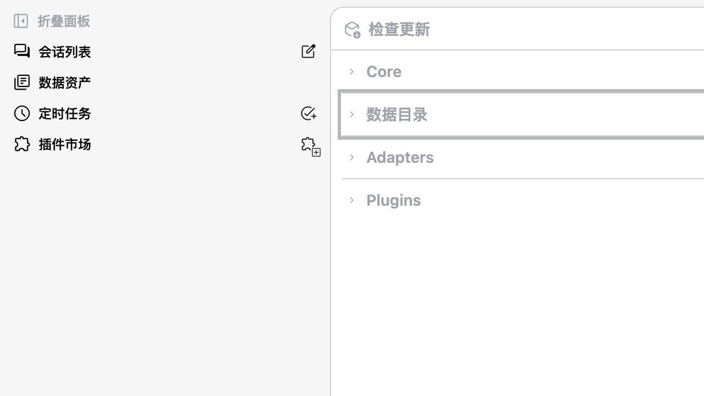

# @oneworks/model-provider-catalog 0.1.0-beta.10

- Publish model-provider identities, official endpoints, capabilities, default-model fallbacks, adapter compatibility, portals, and host matching as a standalone validated catalog.
- Allow the server and client to activate a compatible managed catalog independently from core application releases, with safe fallback to the bundled catalog.

