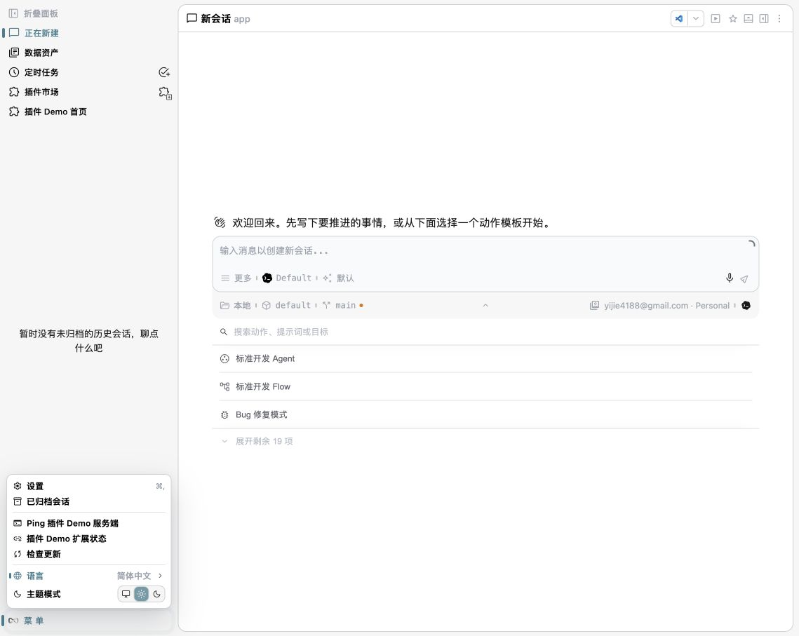

# @oneworks/client 0.1.0-beta.5

- Removed the quick native history import entry from the General config page while keeping the External Sessions management page available from the settings sidebar.
- Fixed the NavRail More menu surface so Electron macOS vibrancy no longer makes the menu content transparent over the session list.
- Replaced the sender effort dropdown with a staged slider that keeps an explicit low, medium, high, or max reasoning effort value and adds max-effort particle feedback.
- Added Codex fast mode controls, expanded Codex reasoning effort stages, and resolved the native Codex default model display to the concrete GPT model with the OpenAI icon.
- Changed the highest reasoning effort track particles to continuous curved random drift, removed thumb particles, added an animated multicolor gradient, and crossfaded effort and fast-mode effects without obscuring slider marks.
- Reworked launcher navigation around explicit URL paths, kept embedded workspace launchers isolated from host routing, and stabilized workspace route effects so launcher and workspace pages no longer redirect back and forth.
- Added plugin-owned launcher route and search contributions so global plugins can expose account and other surfaces without coupling their product logic into the client host.

