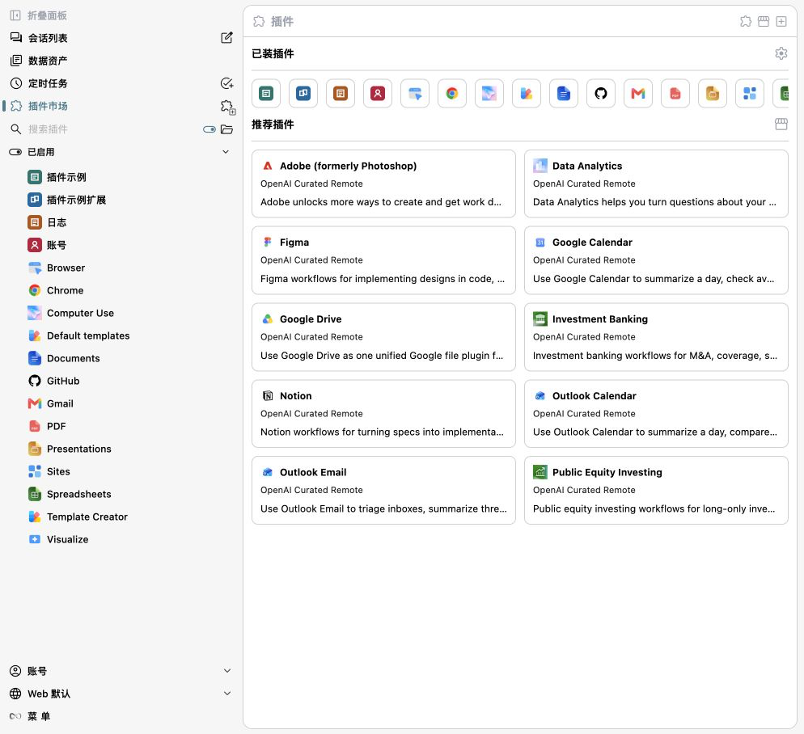
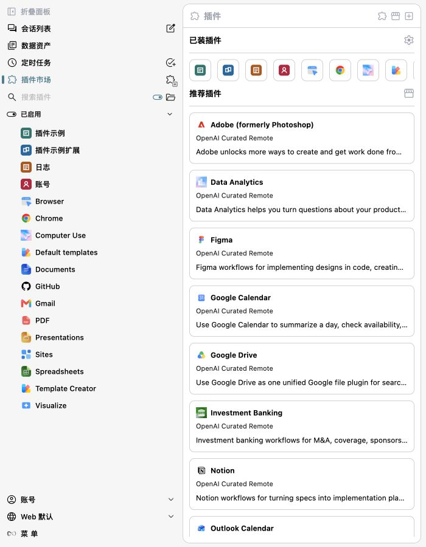

# One Works 0.1.0-beta.5

- Align public workspace packages on the beta.5 prerelease sequence so `oneworks@beta` resolves matching runtime packages instead of mixing older alpha or beta submodules.
- Improve Electron desktop startup and workspace loading so the main shell can appear before slower secondary resources finish mounting.
- Add adapter CLI preparation visibility and compatibility-aware runtime fallback for bundled, cached, user-installed, and auto-installed adapter CLIs.
- Extend Codex and Claude Code adapter support with account/model compatibility fixes and clearer runtime evidence for packaged app verification.
- Add the desktop control and demo-video tooling used for AI-native packaged app validation, including system-recorded Electron demos, load timing reports, per-second frames, and documented recording standards.
- Refine Electron demo-video cursor timing, motion continuity checks, and launcher workspace selection so visual click feedback aligns with the resulting UI transition.
- Unify development-service lifecycle coordination across worktrees with machine-readable state, operation leases, bounded diagnostics, and shared Electron and Android resource ownership.
- Safely render agent-produced local images, video, and audio in chat with seek-capable media responses, and add explicit Markdown link intents for the OneWorks panel, the external browser, and workspace files.
- Unified plugin discovery and marketplace management across OneWorks, Claude Code, Codex, Copilot, Gemini, Kimi, and OpenCode, with localized plugin names, declared icons, runtime detail views, and built-in official marketplace sources.
- Added a searchable Skill Market with built-in Vercel, Anthropic, and Microsoft registries, configurable custom sources, paginated results, and project/global installation.
- Hardened skill installation and archive import with transactional config updates, canonical cross-process locks, explicit overwrite consent, bounded extraction, and rollback on failure.
- Refined the Plugin Home and marketplace layouts for desktop and narrow workspaces, including responsive recommendation cards, accessible installed-plugin actions, and consistent light/dark presentation.

