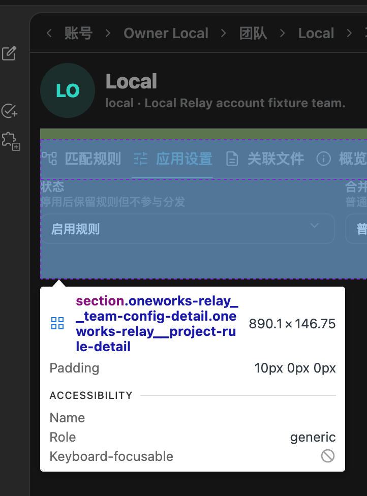

# @oneworks/plugin-relay 0.1.0-beta.5

- Add account and team document management pages for Relay-synced `AGENTS.md` and rules files, including metadata-derived titles, path actions, context menus, and Monaco previews.
- Add a team configuration content page with a shared client JSON editor, version navigation, and draft/publish controls for merge-safe configuration branches.
- Keep team shared configuration away from conflict-prone local defaults such as `defaultModelService` and Codex adapter default-account settings.
- Add global Relay account navigation for launcher and workspace shells, including account lists, additional sign-in actions, and route-aware account, team, configuration, and document pages.
- Add team project-rule list and detail pages with canonical Git remote matching, validated repository editing, automatic persistence, host notifications, and stable breadcrumb/tab behavior.
- Add assignment-scoped project-rule documents with opaque encrypted-format Relay snapshots, traversal- and symlink-safe local progressive sync, Monaco editing, and prompt guidance only when the current Git repository matches the rule; document the operator-visible threat model explicitly.
- Add a client-native, server-aware login flow that discovers password, passkey, verification-code, and SSO capabilities while preserving the hosted compatibility fallback.
- Let Relay instances publish their avatar and availability for the Launcher server picker, with non-blocking discovery, cached identity, accessible status indicators, and row-level login navigation.
- Persist Relay server identity by source, retain cached metadata when services are temporarily unavailable, and expose capability-driven login tabs with inline registration and server switching.
- Restrict login callbacks to explicitly trusted Client origins and document the server identity and callback configuration.

