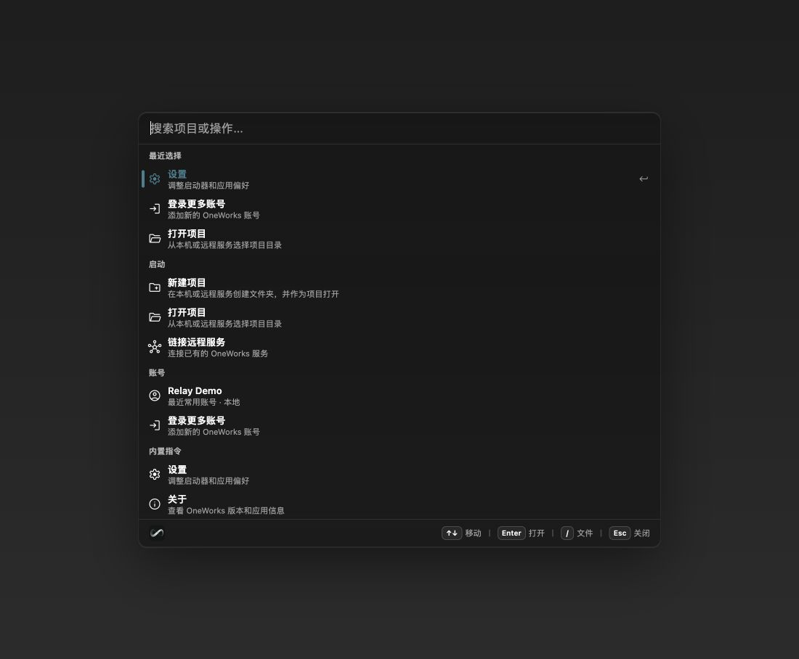

# One Works 0.1.0-beta.8

- Align every workspace package on `0.1.0-beta.8` so the beta channel resolves one coherent release across apps, runtimes, adapters, channels, and plugins.
- Add the One Works official plugin marketplace to new and existing workspaces so first-party plugins remain discoverable without manual source configuration.
- Match marketplace searches against display names, package names, and localized aliases, including `中国方案主题` for the China Edition Theme plugin.
- Harden packaged plugin discovery, managed-plugin synchronization, and hook warmup so marketplace installs can be enabled, removed, and restored reliably.
- Bundle Relay as a default built-in plugin, preserve its shorthand configuration and explicit-disable semantics, and expose Standard Development through the Demo plugin.
- Keep marketplace recommendations useful after featured plugins are installed, remove CUA setup actions from Launcher search, and use indicator-only selection styling in the default Launcher theme.

