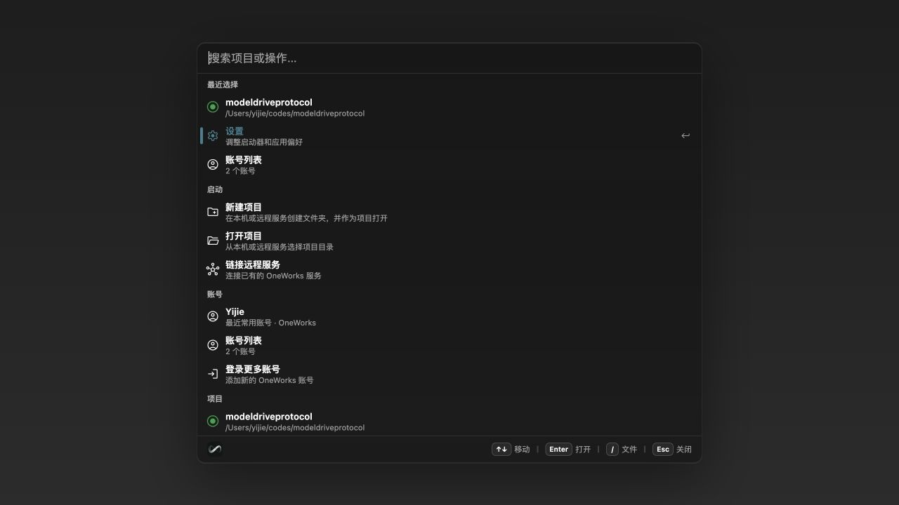
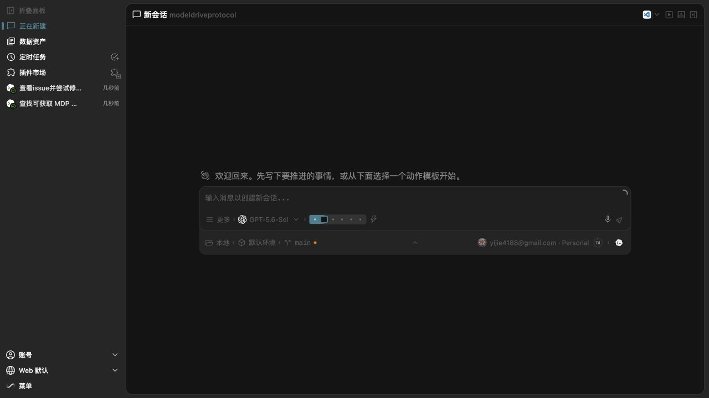
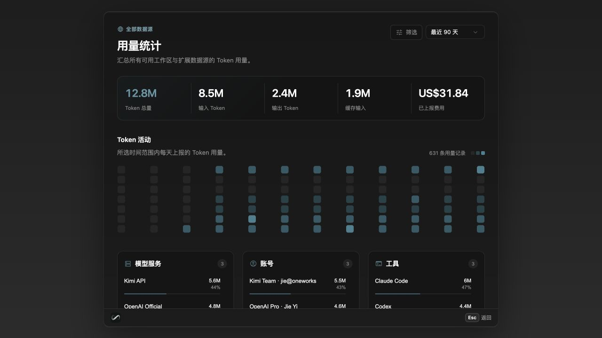
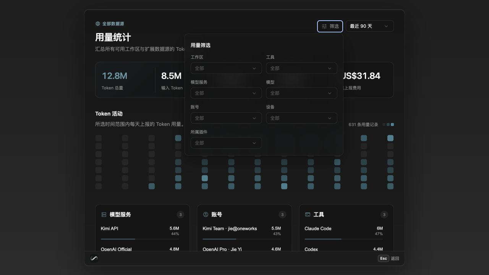
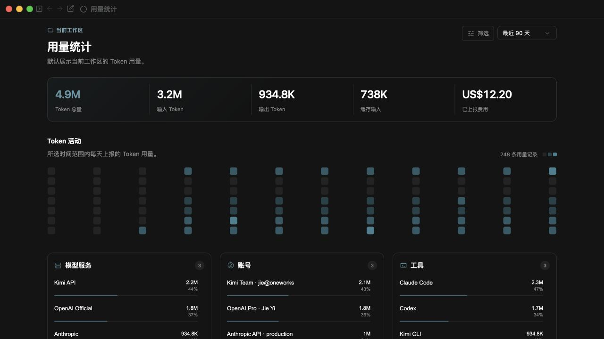
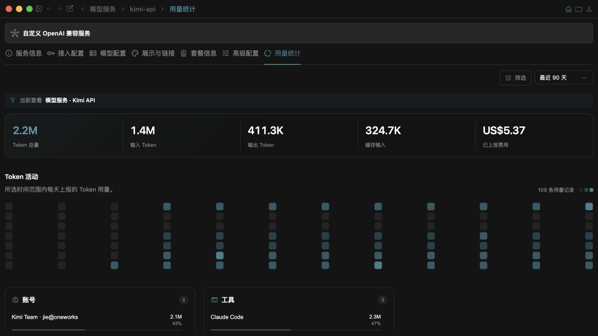

# @oneworks/client 0.1.0-rc.0

- Add a Launcher entry point for importing Codex and Claude Code history, resolve imported sessions to canonical projects, and open the resulting workspace directly from the project list.
- Preserve the original imported-session timestamp separately from list activity recency.
- Show a provenance divider at the top of migrated Codex history.
- Add unified token usage analytics across Launcher, workspace settings, model-service details, and account details, including local adapters, plugin/Relay sources, multiple accounts, model attribution, and adaptive filters.
- Load the active provider catalog from the server so newly published providers appear in model-service settings without requiring a full client release, and expose catalog updates as their own module group.

