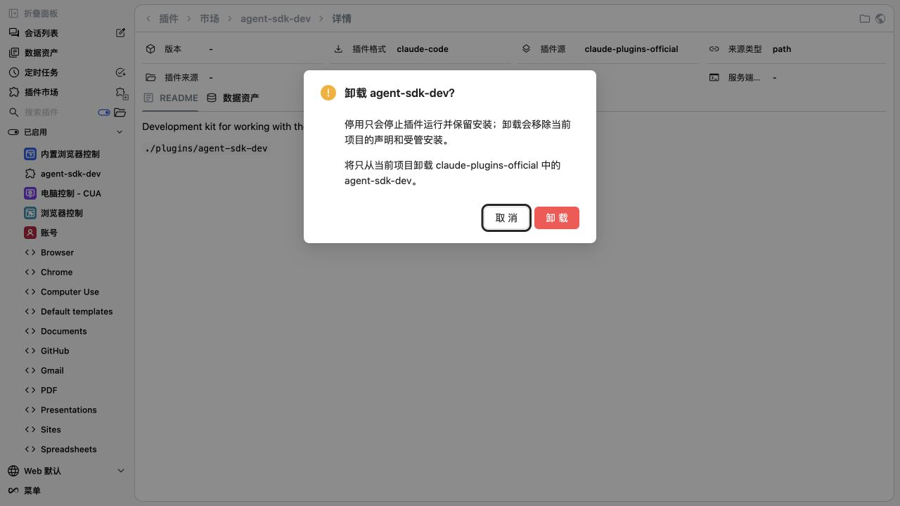
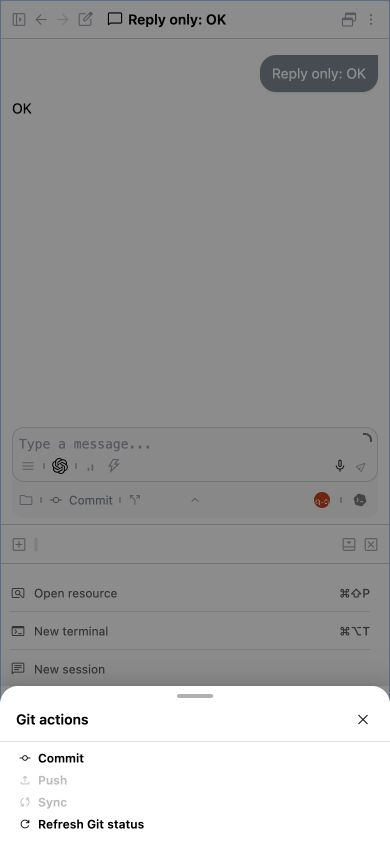
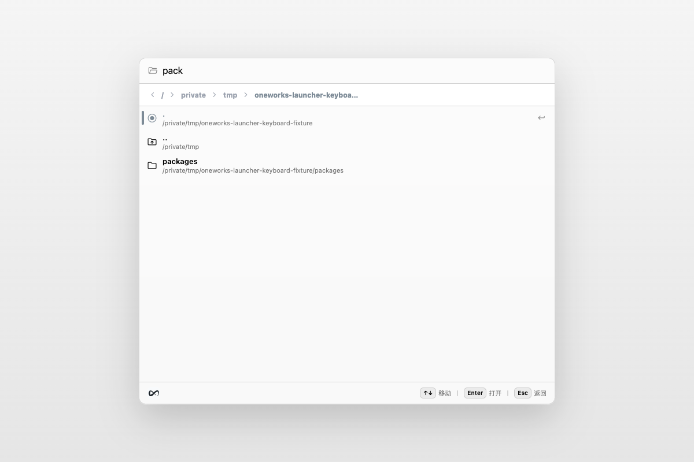

# One Works 1.0.0-rc.2

- Make plugin marketplace install and removal actions reflect committed results immediately, remain retryable after failure, and converge safely across route, scope, server, and plugin-runtime refreshes.

  

- Show the real Desktop Launcher earlier and keep clean-profile startup reliable by moving built-in runtime cache preparation out of the server critical path, hydrating manager data incrementally, and cleaning up owned background work on exit.
- Fix model provider catalog updates failing during installation from the module update screen, while returning stable client errors for malformed or unknown update targets.
- Prefer adapter packages from the current development workspace over stale managed caches, while preserving installed and packaged runtime cache precedence.
- Add Channel Runtime v2 foundations for entity-bound channel links, sender-scoped commands and approvals, cross-channel identity linking, resumable conversations, availability policies, and the first-party OneWorks channel.
- Manage multiple Claude Code accounts through the official CLI login flow, isolated account profiles, portable or device-bound credential handling, cached usage, and Relay-safe account synchronization.
- Add a generic manager-owned runtime broker with owner-bound workspace leases, lease-capable idempotent callbacks, bidirectional events/requests, stale cleanup, and reusable adapter/plugin drivers.
- Reuse Codex app-server processes across manager-launched workspaces, warm up to three configured account profiles without blocking startup, and route managed hooks back to the owning workspace while keeping skills thread-scoped.
- Make Lark role bots in multi-bot chats respond only when the structured mention targets that exact bot, including fail-closed handling for commands addressed to another bot.
- Keep channel connections and runtime-store consumption on the same workspace server in Web launcher mode, preventing duplicate manager connections and channel sessions that remain stuck without an executor.
- Reject ChannelLink sets that reuse one channel key across different entities while allowing one entity to bind multiple external chats.
- Refresh Git status automatically while visible, expose a localized manual refresh in desktop and compact menus, and preserve authoritative results across overlapping updates.

  

- Localize chat archive and restore success feedback in English and Chinese.
- Add localized, keyboard-accessible single-confirm deletion for archived conversations, while synchronizing mounted archive caches after successful deletes.
- Add privacy-safe diagnostics across Web, PWA, Electron, CLI, Relay, and Codex-compatible OTLP ingestion.
- Add configurable personal and team Model Service usage reporting without collecting prompts, responses, credentials, or source content.
- Add a unified Admin data dashboard for observed DAU, WAU, MAU, startup health, JavaScript exception fingerprints, and Model Service usage.
- Add local support bundles containing bounded diagnostic facts, pseudonymized identifiers, and no raw application logs.
- Keep the Launcher project directory search editable with the Left and Right Arrow keys, while retaining parent and active-directory navigation when the caret reaches the matching input boundary.
- Roll out the Linear One Works visual identity across app, desktop, Android, Relay, extensions, public profiles, social previews, and generated distribution assets, with distinct Moonshot and Kimi provider artwork and one canonical brand profile.
- Publish Pi's official light and dark marks through the product brand catalog, Brand Studio compositions, and generated social and Open Graph distribution assets.
- Add a first-class Pi coding-agent adapter with persistent RPC sessions, native/default model reuse, and routed model, tool, and permission integration.

