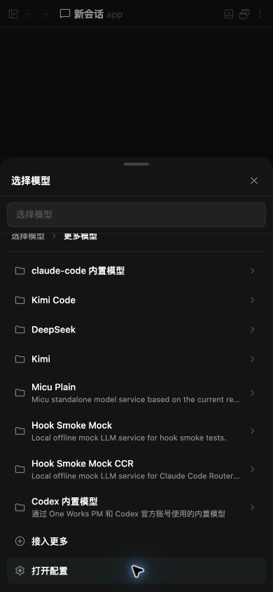

# One Works 1.0.0-rc.3

- Add Channel Runtime v2 and complete channel-backed chat rooms, including navigation through the host workspace UI.
- Add managed adapter accounts and the Pi coding-agent integration with its catalog and product assets.
- Add privacy-safe diagnostics, Model Service usage dashboards, and Relay daily-activity views.
- Make Desktop startup feel faster while hardening packaging, signing, and recoverable release operations.
- Improve reliability for plugin uninstalls, archive deletion feedback, chat Git status, launcher keyboard navigation, and chat-room layout.
- Distribute the macOS rc.3 installers unsigned with a complete ad-hoc seal; Gatekeeper requires manual approval and no Apple notarization is requested.
- Add protocol-safe Model Service routing, Codex account-pool failover, and optional sharing of Codex built-in models with other One Works adapters while keeping each adapter's own account selector unchanged.

  
- Add a first-class Cursor Agent CLI adapter with managed installation, resumable streaming sessions, native skills, MCP and hook integration, plus read-only migration of local Cursor conversation history into One Works.
- Include Cursor and Grok in the product brand catalog so catalog-driven assets cover every built-in adapter.
- Add Shikitor and Cordis as organization-scoped vendor submodules, with Shikitor using Cordis to power its extensible editor-plugin playground.
- Make terminal tab closing reliable across the bottom panel, Workspace drawer, and mobile overview by confirming active processes, preserving terminals that cannot be stopped, restoring focus to visible controls, and keeping canceled native tab closes in place.
- Add member-scoped external channel connections and Leaders for Team Chats, including a built-in Auto Leader that delegates and follows up work across selected members, definition-driven single-select Leaders with automatically selected related members, a playful hiring entry, multi-room mappings, per-connection processing policies, deduplicated inbound routing, delivery-state degradation, and related-channel/member attribution in the UI.

  
