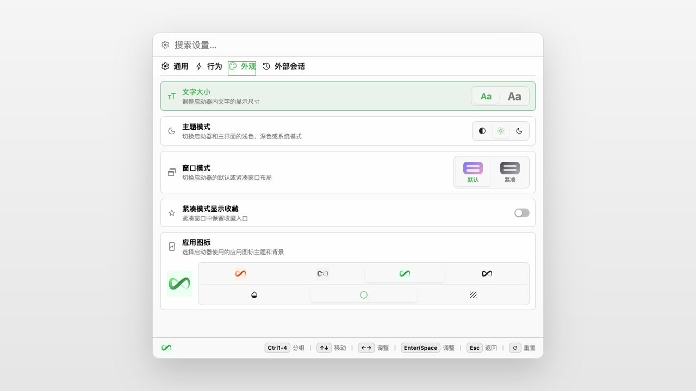

# One Works 1.0.0-rc.4

- Make Launcher settings and update behavior follow the active runtime: Electron retains desktop APIs and readiness, Android and partial device shells use Web API configuration without desktop bridge calls, and installed PWAs are identified by their actual display mode.

