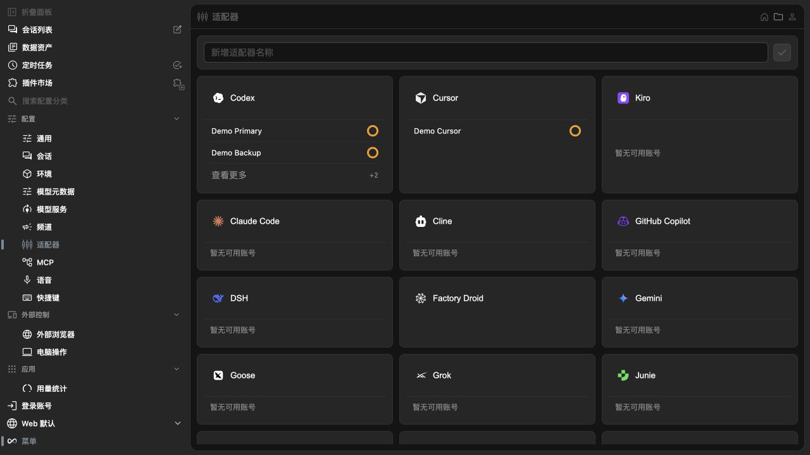

# One Works 1.0.0-rc.5

- Redesign adapter configuration with account-aware summary cards, tabbed settings, model, account, and advanced details, automatic account previews, and theme-aware canonical icons for Cursor, DSH, Goose, Grok, and Kiro.

  
- Let One Works use the default Claude Desktop or CLI login alongside multiple isolated `CLAUDE_CONFIG_DIR` accounts, with concurrent sessions, deterministic same-identity deduplication, and safe default-account remapping. Account views also show identity-matched Claude quota and reset-window details without opening another browser flow.
- Restore the sandboxed preload bridge in packaged Desktop builds so Launcher actions can reliably open and create local projects.
- Coordinate session creation across HTTP and WebSocket connections, preventing duplicate records when a session is slow or cancelled during startup.
