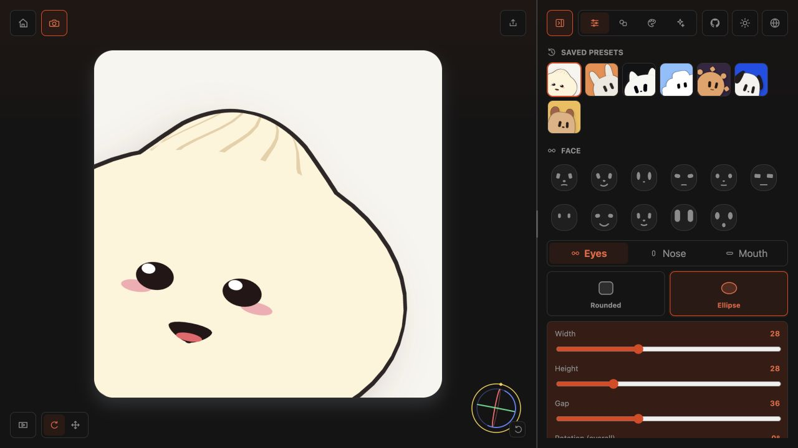

# Avatar

- Added the integrated 3D Avatar editor with curved geometric bodies and configurable eyes, noses, and mouths.
- Added camera/export modes, shape-aware previews, saved presets, and URL-persisted editor state.
- Added a keyframe animation editor and playback library with reusable expression and motion presets.
- Added resizable frosted-glass controls for the sidebar and animation panel.
- Added SVG and PNG downloads for the current 3D camera view, plus animated GIF export for selected animations.
- Added transparent camera backgrounds with frame-aware SVG, PNG, and GIF output.
- Added a 3D-aware Agent Skill and bilingual developer guidance for sharing editable sources and exported assets.
- Replaced the legacy 2D `@oneworks/avatar` package with the versioned 3D definition and animation runtime, including deterministic seeded definitions.
- Added matching `1.0.0-rc.6` SDK surfaces for React, Vue, Vanilla JavaScript, and opt-in Web Components, including the complete editor and custom animation libraries.
- Added configurable eye highlights and vector surface decals for blush, mouth marks, badges, and other pose-aware model details.
- Added Bun as a built-in avatar with curved crown pleats, face decals, and a pose-aware Claude Spark mark on the back.
- Avatar deployment now triggers when the app repository updates the Avatar submodule pointer.

